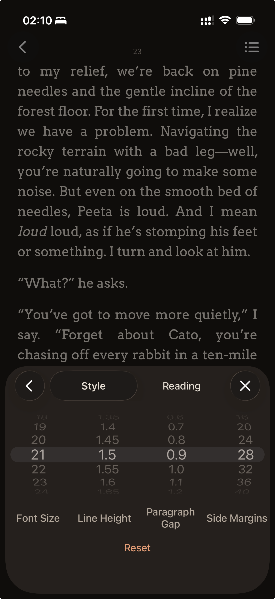
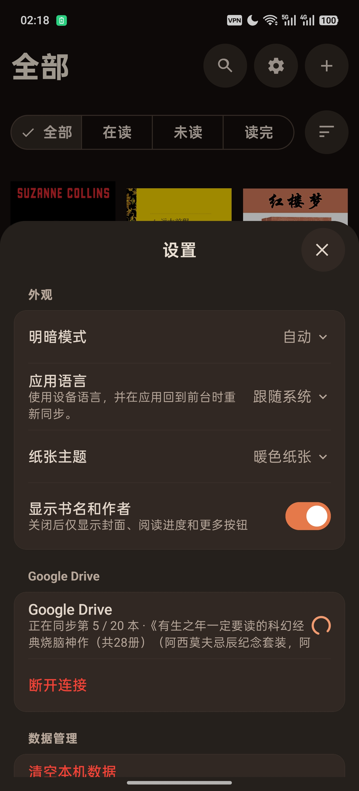
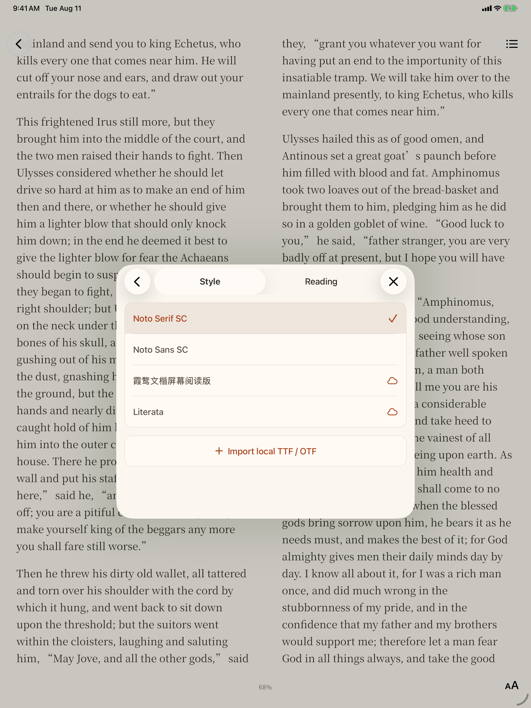

# Persimmon

<p align="right"><a href="./README.md">English</a></p>

<p align="center"><em>Read. Nothing else.</em></p>

Persimmon（柿子）是一个本地优先的 iOS / Android
EPUB 阅读器。它不使用 WebView：可重排 EPUB 会先编译成平台无关、带版本的文档模型，再由共享分页器生成页面，最后交给 React
Native Skia 原生绘制。

Android APK 可以从本仓库的
[Releases](https://github.com/chihumyum/Persimmon/releases) 或
[Persimmon 官网](https://persimmon.cc) 下载。iOS App 可通过官网的 App Store 跳转链接下载。

## 为什么是 Persimmon

- **把空间留给书。** 界面围绕阅读本身，不加入社交、广告或与阅读无关的工具。
- **为触控反复调校的翻页。**
  动画跟随手势，连续快速滑动时依然流畅，也支持像用拇指拨动纸书一样快速往回翻页。
- **免费的云同步。** 在设备间同步书籍与阅读进度，无需 Persimmon 订阅。

<p align="center">

https://github.com/user-attachments/assets/a7dd5166-b9cd-491d-8166-04f7361ee171

</p>

<p align="center">

https://github.com/user-attachments/assets/57c71d41-e69f-4fd6-9cf0-4000cb227ba9

</p>

## 界面

以下是 Persimmon 在 iPhone、iPad 和 Android 上的真实界面。

<p align="center">
  
  &nbsp;
  
  &nbsp;
  
  <br />
  <sub>书库与同步 · 阅读控制 · App 设置</sub>
</p>

<p align="center">
  
  <br />
  <sub>iPad 阅读界面与本地字体选择</sub>
</p>

## 已实现

- 导入无 DRM、可重排的 EPUB 2 / EPUB 3。
- 有边界地解析 ZIP、OPF、XHTML、NCX 和导航文档。
- 在本机分别保存原始 EPUB、元数据、封面、资源和阅读进度。
- 搜索、筛选和排序书库，并查看、导出、同步或删除书籍。
- 章节级分页、目录跳转、排版和主题设置、本地字体、稳定位置续读。
- Skia 原生页面和可交互、经过物理参数调校的翻页动画。
- 使用免费的云同步在设备间同步书籍与阅读进度。
- 英语、简繁中文、日语、韩语、德语、法语、西班牙语和巴西葡萄牙语界面。

Google Drive 同步已在双端实现，但分发版能否登录还取决于 Google
OAuth 的发布状态和测试用户配置。自行构建前请阅读[同步说明](docs/google-drive-sync.md)。

## 明确限制

Persimmon 面向普通可重排书籍。目前不支持 DRM、fixed-layout
EPUB、PDF、MOBI、书内脚本、MathML、浏览器级完整 CSS，以及持久化高亮和批注。EPUB 内容按不可信输入处理：不执行脚本，CSS 只进入显式安全白名单。

## 架构

核心数据路径：

```text
EPUB archive -> versioned BookIR -> shared paginator -> PageScene -> native Skia
```

工作区将 EPUB 导入、平台无关书籍模型、分页、翻页机制、Skia 渲染和 Expo 应用拆开。翻页渲染器通过公开的
[`react-native-natural-page-turn`](https://github.com/chihumyum/react-native-natural-page-turn)
Git submodule 引入。

进一步参见[架构](docs/architecture.md)、[设计系统](docs/design-system.md)和
[翻页库集成](docs/page-turn-library.md)。

## 开发

环境要求：

- Node.js 22.23.1
- 由 Corepack 管理的 pnpm 10.17.1
- iOS 原生构建需要 Xcode
- Android 原生构建需要 Android Studio 和 Android SDK

克隆时一并拉取公开 submodule：

```bash
git clone --recurse-submodules https://github.com/chihumyum/Persimmon.git
cd Persimmon
corepack enable
pnpm install --frozen-lockfile
```

使用项目专用 development build 启动 Expo：

```bash
pnpm dev:native
```

通过 `pnpm native:ios:device` 或 `pnpm native:android:device`
安装原生开发客户端。项目不支持 Expo Go。

## 验证

运行与 GitHub Actions 相同的总门禁：

```bash
pnpm verify
```

它会检查格式、lint、TypeScript、单元测试、Expo 依赖和项目健康状态，以及 iOS /
Android 生产 JavaScript
bundle。维护者还会测试私有 EPUB 语料和签名构建，但普通开发与 PR 不需要私有书籍或发布凭据。

历史真机结果记录在
[MVP 验收文档](docs/mvp-acceptance.md)中；它只证明文档注明日期和版本的状态，不代表此后的每个提交都重新完成了真机验收。

## 发布

`pnpm release:android` 和 `pnpm release:ios`
构建并验证正式产物，但不自动发布。已有签名 APK 可以先做完全无副作用的检查：

```bash
pnpm publish:android:apk -- --dry-run path/to/Persimmon.apk
```

稳定版会把同一份已验证 APK 发布到本仓库 GitHub Releases 和 Cloudflare
R2 稳定下载地址。GitHub
prerelease 永远不会覆盖稳定 R2。发布只允许维护者手动触发。

## 贡献与安全

欢迎范围明确的 bug 修复、测试、无障碍改进和 EPUB 兼容性工作。提交 PR 前请阅读
[CONTRIBUTING.md](CONTRIBUTING.md)。公开问题和功能建议使用
[GitHub Issues](https://github.com/chihumyum/Persimmon/issues)；漏洞请按
[SECURITY.md](SECURITY.md) 私密报告，不要公开建 issue。

路线图和合并决定由维护者控制，贡献审查和支持均为 best-effort，不承诺响应时效。

## 许可证与品牌

源码和文档采用
[Apache License 2.0](LICENSE)，另行标注的第三方内容和 Persimmon 品牌资产除外。Persimmon 名称、Logo、应用图标、产品截图和整体品牌视觉不随 Apache-2.0 授权。参见
[TRADEMARKS.md](TRADEMARKS.md) 和 [NOTICE](NOTICE)。

根 package 的 `private` 字段只用于防止误发 npm 包，不限制仓库许可证授予的权利。
